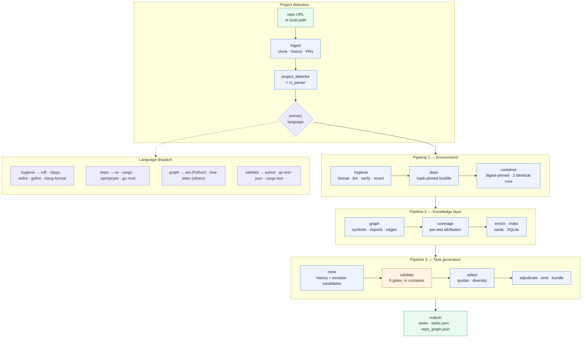

# stress-stack

stress-stack takes a real-world software repository — typically one with no pinned
dependencies, no container, no linting, and patchy tests — and turns it into three
things: a reproducible environment that builds and tests identically twice in a row,
a machine-readable knowledge layer describing every file and symbol in it, and ten
independently validated benchmark tasks for AI coding agents. Every task ships with
the tree an agent starts from, the reference solution, the tests that decide pass or
fail, and container logs proving those tests fail before the change and pass after
it. A model writes prose and judges difficulty; it never decides which tasks ship.
Every acceptance decision is a measured container run, recorded and re-runnable.

---

## Architecture



Working state lives in `.stress_stack/` inside the target repository; the deliverable
is written to `output/`.

---

## Setup

### LLM support

**Model inference is provided exclusively through [OpenRouter](https://openrouter.ai).**
There is no direct Anthropic, OpenAI, or Google integration — every model call in the
pipeline goes through a single OpenRouter client, and roles (`worker`, `synthesis`,
`reasoning`) map to model names in config rather than to vendors.

A key is **optional**. Without one, `enrich` and `adjudicate` degrade gracefully:
file cards are skipped and each task keeps its *measured* difficulty tier instead of
a reasoned one. All ten tasks are still generated and validated, because no gate
depends on a model.

### Requirements

| | |
|---|---|
| Python | 3.12+ |
| Docker | running daemon — validation happens only in containers |
| git | any recent version |

### Install

```bash
git clone https://github.com/AdityaKaleeswarGK/LH2_take_home_assignment.git
```

```bash
cd LH2_take_home_assignment && python3.12 -m venv .venv && .venv/bin/pip install -e .
```

To run `stress-stack` from anywhere in your terminal, put the entry point on your
`PATH`:

```bash
ln -s "$PWD/.venv/bin/stress-stack" /usr/local/bin/stress-stack
```

Verify:

```bash
stress-stack --help
```

### Configure the OpenRouter key (optional)

Either export it:

```bash
export OPENROUTER_API_KEY=sk-or-...
```

Or store it once, outside any analysed repository:

```bash
stress-stack configure --api-key sk-or-...
```

---

## Running it

One documented entry point runs all three pipelines end to end:

```bash
./run.sh https://github.com/mahmoud/glom
```

Equivalently, with the profile-aware orchestrator:

```bash
stress-stack orchestrate https://github.com/mahmoud/glom --output output
```

Both accept a URL or a local path.

### What you get

| Path | Contents |
|---|---|
| `output/tasks/` | the ten task folders — `input/`, `solution/`, `verifier/`, `evidence/` |
| `output/tasks.json` | manifest indexing all ten with provenance and validation status |
| `output/repo_graph.json` | the knowledge layer |
| `output/repo/` | the transformed repository — pinned, containerized, lint-clean |
| `<repo>/.stress_stack/` | all working state and evidence (see below) |

`.stress_stack/` inside the target repository is where every claim is backed up:

| Path | Contents |
|---|---|
| `.stress_stack/hygiene/` | lint report, before/after test runs, comparison |
| `.stress_stack/container/` | Dockerfile, build log, both determinism runs |
| `.stress_stack/knowledge/` | graph, coverage map, candidates, validation verdicts |
| `.stress_stack/tasks/<id>/evidence/` | per-task JUnit XML for every gate run |
| `.stress_stack/pipeline_run.json` | every stage, its status and duration |
| `.stress_stack/tools/`, `cache/` | provisioned virtualenvs and the model-response cache |

The glom run's evidence is committed in this repository under
[`evidence/glom/`](evidence/glom) so it can be inspected without re-running anything.
`tools/` and `cache/` are excluded from that copy — they are 67 MB of virtualenvs and
5 MB of cached model responses, reproducible rather than evidential.

---

## Commands

Each stage is also a standalone command, so any stage can be re-run without
repeating the ones before it.

| Command | What it does |
|---|---|
| `stress-stack orchestrate <src>` | detect the ecosystem, then run every stage |
| `stress-stack run <src>` | run every stage |
| `stress-stack ingest <src>` | clone, extract history and pull requests |
| `stress-stack hygiene <src>` | format, lint, verify no regression, revert if any |
| `stress-stack deps <src>` | resolve and hash-pin dependencies |
| `stress-stack graph <src>` | build and verify the symbol graph |
| `stress-stack coverage <src>` | measure which tests execute which symbols |
| `stress-stack testgen <src>` | generate tests, gated on mutation |
| `stress-stack container <src>` | build the image and prove two runs identical |
| `stress-stack enrich <src>` | per-file cards and repository blueprint (model) |
| `stress-stack index <src>` | queryable SQLite projection |
| `stress-stack mine <src>` | rank history and excision candidates |
| `stress-stack validate <src>` | run the eight gates over the ranked pool |
| `stress-stack select <src>` | apply the quotas and diversity floor |
| `stress-stack adjudicate <src>` | an agent reads the code and judges difficulty (model) |
| `stress-stack emit <src>` | write task.json, golden solutions, manifest |
| `stress-stack bundle <src>` | assemble `output/` |

Useful flags:

```bash
stress-stack run <src> --skip enrich,adjudicate
```

```bash
stress-stack orchestrate <src> --history-limit 30 --excision-limit 12 --output output
```

### Running the container test suite by hand

The image the pipeline builds is a normal image; the acceptance bar is that this
passes twice with identical results.

```bash
docker run --rm --network=none --cap-drop=ALL stress-stack/glom:verify
```

---

## Language support

| Ecosystem | Environment | Knowledge layer | Task generation |
|---|---|---|---|
| Python | ruff, uv | `ast` | full — history + excision |
| Go | gofmt, go vet, go mod | tree-sitter | excision |
| Rust | cargo fmt, clippy, cargo | tree-sitter | excision |
| TypeScript / JavaScript | prettier, eslint, npm/pnpm | tree-sitter | not yet |
| C / C++ | clang-format, clang-tidy | tree-sitter | not yet |

Anything without a parser or test plan is reported as `unsupported` with a reason,
never as a silent zero. See `REPORT.md` for the full account of what is missing.

---

## Tests

```bash
.venv/bin/python -m pytest -q
```

```bash
.venv/bin/python -m ruff check src tests
```
